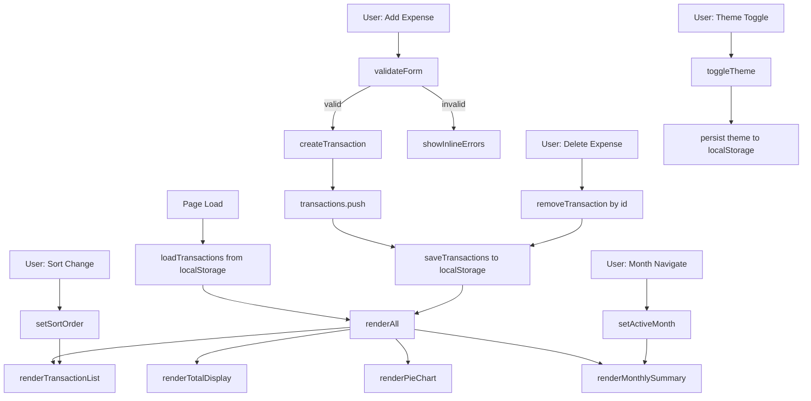

# Design Document: Expense & Budget Visualizer

## Overview

The Expense & Budget Visualizer is a single-page, client-side web application built with vanilla HTML, CSS, and JavaScript. It enables users to record daily expenses, view a running total, explore spending distribution via a pie chart, and browse a sortable transaction history — all without a backend server. Data is persisted to `localStorage` so records survive page reloads and browser restarts.

The project is deliberately constrained to three files (`index.html`, `css/style.css`, `js/script.js`) and one external CDN library (Chart.js) to keep the codebase approachable for a beginner software engineering course.

### Key Design Decisions

| Decision | Rationale |
|---|---|
| Vanilla HTML/CSS/JS only | Course requirement; teaches foundational skills without framework abstraction |
| Chart.js via CDN | Provides a production-quality pie chart without a build step |
| `localStorage` for persistence | Zero-backend requirement; sufficient for a personal expense tracker |
| Mobile-first CSS | Most users access financial dashboards on mobile; desktop is an enhancement |
| Single JS file | Keeps the module boundary clear for beginners while avoiding import complexity |
| CSS custom properties for theming | Enables dark/light mode with a single class toggle on `<body>` |

---

## Architecture

The application follows a simple **data → render** flow with no frameworks. All state lives in a single in-memory array (`transactions`) that is kept in sync with `localStorage`. Every user action (add, delete, sort, theme toggle, month navigation) mutates that array (or reads a derived view of it) and then triggers a full re-render of the affected UI components.



### State Model

All mutable state is kept in `js/script.js` as module-level variables:

```
transactions    — Transaction[]   — source of truth for all expense data
chartInstance   — Chart | null    — the single Chart.js instance (updated in place)
sortOrder       — string          — current sort key ('newest'|'oldest'|'highest'|'lowest')
activeTheme     — string          — 'light' | 'dark'
activeMonth     — string          — currently displayed month in 'YYYY-MM' format
```

---

## Components and Interfaces

### HTML Structure (`index.html`)

The page is divided into semantic sections that map directly to the requirements' named UI components:

```
<body data-theme="light">
  <header>
    <h1>Expense & Budget Visualizer</h1>
    <button id="theme-toggle">🌙 Dark Mode</button>
  </header>

  <main>
    <!-- Req 5: Total spending card -->
    <section id="total-section">
      <p>Total Balance</p>
      <p id="total-display">Rp0</p>
    </section>

    <!-- Req 2 & 9: Add expense form -->
    <section id="form-section">
      <form id="expense-form">
        <label for="item-name">Item Name</label>
        <input type="text" id="item-name" name="item-name" />
        <span class="error" id="error-name"></span>

        <label for="amount">Amount (Rp)</label>
        <input type="number" id="amount" name="amount" min="1" />
        <span class="error" id="error-amount"></span>

        <label for="category">Category</label>
        <select id="category" name="category">
          <option value="">-- Select Category --</option>
          <option value="Food">Food</option>
          <option value="Transport">Transport</option>
          <option value="Fun">Fun</option>
        </select>
        <span class="error" id="error-category"></span>

        <button type="submit">Add Expense</button>
      </form>
    </section>

    <!-- Req 6: Pie chart -->
    <section id="chart-section">
      <h2>Spending by Category</h2>
      <div id="chart-container">
        <canvas id="spending-chart"></canvas>
        <p id="chart-empty-state" hidden>No spending data available.</p>
      </div>
    </section>

    <!-- Req 13: Sort controls -->
    <section id="sort-section">
      <label for="sort-select">Sort by:</label>
      <select id="sort-select">
        <option value="newest">Newest First</option>
        <option value="oldest">Oldest First</option>
        <option value="highest">Highest Amount</option>
        <option value="lowest">Lowest Amount</option>
      </select>
    </section>

    <!-- Req 4: Transaction list -->
    <section id="list-section">
      <h2>Transaction History</h2>
      <ul id="transaction-list"></ul>
    </section>

    <!-- Req 14: Monthly summary -->
    <section id="monthly-section">
      <h2>Monthly Summary</h2>
      <div id="month-nav">
        <button id="prev-month">&#8592;</button>
        <span id="active-month-label"></span>
        <button id="next-month">&#8594;</button>
      </div>
      <p id="monthly-total"></p>
    </section>
  </main>
</body>
```

### JavaScript Functions (`js/script.js`)

Functions are grouped by concern. Each function has a single, clear purpose.

#### Storage Functions
| Function | Signature | Description |
|---|---|---|
| `loadTransactions` | `() → Transaction[]` | Reads and parses `localStorage`; returns `[]` on parse failure |
| `saveTransactions` | `(transactions: Transaction[]) → void` | Serializes array to JSON and writes to `localStorage` |
| `loadTheme` | `() → string` | Reads persisted theme (`'light'` or `'dark'`) from `localStorage` |
| `saveTheme` | `(theme: string) → void` | Persists selected theme to `localStorage` |

#### Transaction Functions
| Function | Signature | Description |
|---|---|---|
| `createTransaction` | `(name, amount, category) → Transaction` | Builds a new Transaction object with auto-generated `id` and `date` |
| `removeTransaction` | `(id) → void` | Filters `transactions` array, saves, re-renders |
| `generateId` | `() → string` | Returns a unique string ID (e.g., `Date.now().toString()`) |
| `getCurrentDate` | `() → string` | Returns today's date as `YYYY-MM-DD` |

#### Validation Functions
| Function | Signature | Description |
|---|---|---|
| `validateForm` | `(name, amount, category) → { valid: boolean, errors: object }` | Returns validation result with field-specific error messages |
| `showErrors` | `(errors: object) → void` | Populates inline error `<span>` elements for each field |
| `clearErrors` | `() → void` | Empties all inline error `<span>` elements |

#### Render Functions
| Function | Signature | Description |
|---|---|---|
| `renderAll` | `() → void` | Calls all individual render functions; used after init and data changes |
| `renderTotalDisplay` | `(transactions: Transaction[]) → void` | Calculates sum and updates `#total-display` |
| `renderTransactionList` | `(transactions: Transaction[], sortOrder: string) → void` | Sorts and renders `<li>` elements into `#transaction-list` |
| `renderPieChart` | `(transactions: Transaction[]) → void` | Aggregates by category, updates or creates Chart.js instance |
| `renderMonthlySummary` | `(transactions: Transaction[], month: string) → void` | Filters by month, calculates total, updates `#monthly-total` |

#### Sorting Function
| Function | Signature | Description |
|---|---|---|
| `getSortedTransactions` | `(transactions: Transaction[], sortOrder: string) → Transaction[]` | Returns a sorted *copy* of the array without mutating the original |

#### Theme Functions
| Function | Signature | Description |
|---|---|---|
| `applyTheme` | `(theme: string) → void` | Sets `data-theme` attribute on `<body>` and updates toggle button label |
| `toggleTheme` | `() → void` | Flips active theme, saves, applies |

#### Event Handlers
| Function | Description |
|---|---|
| `handleFormSubmit` | Validates form, creates transaction, saves, re-renders, clears form |
| `handleDeleteClick` | Reads `data-id` from clicked delete button, calls `removeTransaction` |
| `handleSortChange` | Updates `sortOrder`, re-renders transaction list |
| `handleThemeToggle` | Calls `toggleTheme` |
| `handleMonthNav` | Increments/decrements `activeMonth`, re-renders monthly summary |

#### Initialization
| Function | Description |
|---|---|
| `init` | Called on `DOMContentLoaded`; loads data and theme, applies theme, sets up event listeners, calls `renderAll` |

### CSS Architecture (`css/style.css`)

The stylesheet uses CSS custom properties for theming, a mobile-first media query strategy, and BEM-inspired class names.

```css
/* ── Custom Properties (tokens) ── */
:root {
  --color-bg: #f5f5f5;
  --color-surface: #ffffff;
  --color-text: #1a1a1a;
  --color-accent: #4a90d9;
  --color-danger: #e05252;
  --color-border: #ddd;
  --color-error: #c0392b;
  --radius: 8px;
  --shadow: 0 2px 8px rgba(0,0,0,0.08);
  --max-width: 640px;
}

[data-theme="dark"] {
  --color-bg: #1a1a2e;
  --color-surface: #16213e;
  --color-text: #e0e0e0;
  --color-accent: #6ab4f5;
  --color-border: #333;
}

/* ── Base & Reset ── */
/* ── Layout: Mobile-first single column ── */
/* ── Header ── */
/* ── Total Card ── */
/* ── Form ── */
/* ── Error Messages ── */
/* ── Chart Section ── */
/* ── Sort Controls ── */
/* ── Transaction List ── */
/* ── Monthly Summary ── */

/* ── Tablet and Desktop (min-width: 768px) ── */
@media (min-width: 768px) {
  /* Centered dashboard with max-width */
}
```

---

## Data Models

### Transaction

The core data object persisted to `localStorage`.

```javascript
/**
 * @typedef {Object} Transaction
 * @property {string} id        - Unique identifier (e.g., "1718000000000")
 * @property {string} name      - Item name, trimmed of whitespace
 * @property {number} amount    - Expense amount as a positive number (stored raw, displayed as Rupiah)
 * @property {string} category  - One of: "Food" | "Transport" | "Fun"
 * @property {string} date      - ISO date string in YYYY-MM-DD format, auto-generated at creation
 */
```

**Example:**
```json
{
  "id": "1718000000000",
  "name": "Nasi Goreng",
  "amount": 25000,
  "category": "Food",
  "date": "2024-06-10"
}
```

### localStorage Schema

| Key | Type | Description |
|---|---|---|
| `expenseVisualizerTransactions` | `string` (JSON array) | Serialized `Transaction[]` — the full expense history |
| `expenseVisualizerTheme` | `string` | `'light'` or `'dark'` — persisted theme preference |

**Serialization contract:** `JSON.parse(JSON.stringify(transactions))` must produce an array element-for-element equivalent to `transactions` — all field names and values preserved exactly (see Req 7.4).

### Validation Rules

| Field | Rule | Error Message |
|---|---|---|
| `name` | Not empty after `trim()` | "Item name is required." |
| `amount` | Parseable as number, `> 0` | "Please enter a valid positive amount." |
| `category` | Value is one of `Food`, `Transport`, `Fun` | "Please select a category." |

### Currency Formatting

All Rupiah display uses:
```javascript
new Intl.NumberFormat('id-ID', { style: 'currency', currency: 'IDR', minimumFractionDigits: 0 })
  .format(amount);
// Output: "Rp25.000"
```

---

## Correctness Properties

*A property is a characteristic or behavior that should hold true across all valid executions of a system — essentially, a formal statement about what the system should do. Properties serve as the bridge between human-readable specifications and machine-verifiable correctness guarantees.*

### Property 1: Valid submission creates a well-formed transaction

*For any* valid combination of (non-empty name, positive numeric amount, non-empty category), calling `createTransaction(name, amount, category)` SHALL return an object that contains all five required fields (`id`, `name`, `amount`, `category`, `date`) with correct types: `id` and `name` and `category` and `date` are strings, `amount` is a number greater than zero, and `date` matches `YYYY-MM-DD` format.

**Validates: Requirements 2.2, 3.1, 3.2, 3.3**

---

### Property 2: Transaction IDs are unique across all creations

*For any* sequence of N calls to `createTransaction`, each call SHALL produce a transaction with an `id` that is distinct from all previously generated IDs in that sequence.

**Validates: Requirements 3.3**

---

### Property 3: Validator rejects all whitespace-only item names

*For any* string whose characters are all whitespace (spaces, tabs, newlines), `validateForm` SHALL return `valid: false` with a non-empty error for the `name` field, and no transaction SHALL be created or saved to localStorage.

**Validates: Requirements 2.3, 2.4, 9.1**

---

### Property 4: Validator rejects all non-positive amounts

*For any* amount value that is empty, non-numeric, zero, or negative, `validateForm` SHALL return `valid: false` with a non-empty error for the `amount` field, and no transaction SHALL be created or saved to localStorage.

**Validates: Requirements 2.3, 2.4, 9.2**

---

### Property 5: Transaction list renders all required fields

*For any* non-empty array of transactions, `renderTransactionList` SHALL produce a list where each rendered entry contains the transaction's name, Rupiah-formatted amount, category, date string, and a delete button bearing the transaction's `id` as a `data-id` attribute.

**Validates: Requirements 4.1**

---

### Property 6: Delete removes exactly one transaction by ID

*For any* transaction array and any transaction `id` present in that array, calling `removeTransaction(id)` SHALL result in a transactions array that contains every original transaction except the one with that `id`, and every other transaction SHALL remain unchanged.

**Validates: Requirements 4.4**

---

### Property 7: Total display equals arithmetic sum of all amounts

*For any* array of transactions (including the empty array), `renderTotalDisplay` SHALL display a value equal to the sum of all `amount` fields. For the empty array the sum SHALL be zero.

**Validates: Requirements 5.1, 5.2**

---

### Property 8: Currency formatting produces valid Rupiah strings

*For any* non-negative integer amount, the currency formatter SHALL return a string that starts with `"Rp"` and contains no decimal separator, using dots as thousand-group separators consistent with `Intl.NumberFormat('id-ID')` output.

**Validates: Requirements 5.3**

---

### Property 9: Serialization round-trip preserves all transaction data

*For any* valid `Transaction[]`, `JSON.parse(JSON.stringify(transactions))` SHALL produce an array that is element-for-element equivalent to the original — identical field names, identical string values, and identical numeric amounts with no type coercion.

**Validates: Requirements 7.1, 7.4**

---

### Property 10: Malformed localStorage data initializes an empty array

*For any* string stored under `expenseVisualizerTransactions` that is not valid JSON (or is valid JSON but not an array), `loadTransactions()` SHALL return an empty array `[]` and SHALL NOT throw an uncaught exception.

**Validates: Requirements 7.5**

---

### Property 11: Sorting produces a sorted copy without mutating source data

*For any* transaction array and any valid sort key (`'newest'`, `'oldest'`, `'highest'`, `'lowest'`), `getSortedTransactions(transactions, sortOrder)` SHALL return a new array in the specified order, and the original `transactions` array SHALL be unchanged (same length, same elements, same order as before the call).

**Validates: Requirements 13.2, 13.3**

---

### Property 12: Delete by ID is sort-order-independent

*For any* transaction array, any valid sort order, and any transaction `id` in that array, deleting by that `id` while a sort is active SHALL remove the transaction with that `id` from the underlying data regardless of the transaction's current display position.

**Validates: Requirements 13.4**

---

### Property 13: Monthly summary total equals sum of same-month transactions only

*For any* transaction array and any target month string (`'YYYY-MM'`), the monthly total SHALL equal the sum of `amount` fields of all transactions whose `date` starts with that month string, and SHALL be zero for any transaction whose `date` does not start with that month string.

**Validates: Requirements 14.1, 14.3, 14.4**

---

### Property 14: Theme toggle is an involution (round-trip)

*For any* initial theme (`'light'` or `'dark'`), calling `toggleTheme()` twice SHALL restore the app to the original theme, both in the `data-theme` attribute on `<body>` and in the value persisted to localStorage.

**Validates: Requirements 12.2, 12.3**

---

## Error Handling

### localStorage Errors
- **Malformed JSON**: `loadTransactions()` wraps `JSON.parse` in a `try/catch`. On any parse error it logs a console warning and returns `[]`.
- **Storage quota exceeded**: `saveTransactions()` wraps `localStorage.setItem` in a `try/catch`. On `QuotaExceededError` it logs a console warning; the UI remains functional with in-memory data (the user is not alerted with a modal — a subtle warning in the console is sufficient for a course project scope).
- **localStorage unavailable** (e.g., private browsing restrictions): Same `try/catch` pattern; the app falls back to in-memory-only operation.

### Validation Errors
- All validation errors surface as inline `<span class="error">` messages next to each invalid field.
- `window.alert()` is never used (Req 9.6).
- Errors are cleared (`clearErrors()`) at the start of every form submission attempt, then re-populated if validation fails.

### Chart.js Errors
- The chart canvas is only accessed after `DOMContentLoaded`.
- If `transactions` is empty, the canvas is hidden and the empty-state message is shown instead.
- The single chart instance (`chartInstance`) is checked for `null` before calling `.update()` — on first render, `new Chart()` creates it; on subsequent renders, `.data` is mutated and `.update()` is called.

### Runtime Errors
- All event listeners use `event.preventDefault()` on the form to prevent unintended page reloads.
- `data-id` attributes on delete buttons are read with `getAttribute('data-id')` — if somehow missing, `removeTransaction` silently no-ops (no crash).

---

## Testing Strategy

### Unit Tests (Example-Based)

Unit tests cover specific behaviors and edge cases using concrete examples:

- **Form Submission**: Submit with valid data → transaction appears in list; submit with each invalid field alone → correct inline error appears.
- **Empty State**: No transactions → list shows "No expenses yet" message; no transactions → chart shows "No spending data available" message.
- **Delete**: Add two transactions, delete the first by ID → only the second remains.
- **Currency Formatter**: `formatRupiah(25000)` → `"Rp25.000"`, `formatRupiah(0)` → `"Rp0"`, `formatRupiah(1250000)` → `"Rp1.250.000"`.
- **Date Generation**: `getCurrentDate()` returns today's date matching `YYYY-MM-DD` regex.
- **Sort UI**: Sort select shows all four options; changing sort re-orders the displayed list.
- **Theme**: Toggle button is visible in header; clicking once changes `data-theme`; clicking again restores it.
- **Monthly Empty State**: Navigate to a month with no transactions → "No expenses recorded for this month."
- **Validation — Category**: Submit with no category selected → inline error on category field.

### Property-Based Tests

Property-based tests use a library such as [fast-check](https://github.com/dubzzz/fast-check) (or an equivalent like Hypothesis for Python, if the test harness differs) to generate many random inputs and verify that universal properties hold. Each test runs a **minimum of 100 iterations**.

Each test is tagged with a comment in the format:
`// Feature: expense-budget-visualizer, Property {N}: {property_text}`

| Property | What the generator varies | What is asserted |
|---|---|---|
| P1: createTransaction shape | Random (name, amount, category) within valid ranges | All 5 fields present with correct types |
| P2: Unique IDs | N sequential createTransaction calls (N from 2–20) | All IDs distinct |
| P3: Whitespace name rejection | Strings composed only of spaces/tabs/newlines | Validator returns `valid: false`, no transaction saved |
| P4: Non-positive amount rejection | Random values: 0, negative numbers, strings, empty string | Validator returns `valid: false`, no transaction saved |
| P5: List renders all fields | Random Transaction[] (1–20 items) | Each rendered entry contains name, amount Rp-string, category, date, delete button with data-id |
| P6: Delete removes exactly one | Random Transaction[] + random target index | Post-delete array length = original − 1, correct item removed |
| P7: Total equals sum | Random Transaction[] (0–20 items with random amounts) | Displayed total equals `amounts.reduce((a, b) => a + b, 0)` |
| P8: Rupiah format | Random non-negative integers 0–10,000,000 | Result starts with "Rp", no decimal point, dots as thousand separators |
| P9: Serialization round-trip | Random Transaction[] | `JSON.parse(JSON.stringify(arr))` element-for-element equal to original |
| P10: Malformed localStorage | Arbitrary strings that are not valid JSON arrays | `loadTransactions()` returns `[]`, no exception thrown |
| P11: Sort produces sorted copy | Random Transaction[] + random sort key | Output is correctly ordered; source array unchanged |
| P12: Delete is sort-order-independent | Random Transaction[], random sort order, random target ID | Underlying data after delete equals data without that ID, regardless of display position |
| P13: Monthly total filters correctly | Random Transaction[] with random dates, random target month | Monthly total = sum of transactions in that month only |
| P14: Theme toggle round-trip | Initial theme ('light' or 'dark') | Two toggles restore original theme in DOM and localStorage |

### Integration / Manual Tests

Since this is a pure client-side app with no backend, "integration tests" are browser-based checks:

- Open `index.html` in a browser; add several expenses across different categories and months.
- Reload the page and verify all data is restored from `localStorage`.
- Open DevTools → Application → Local Storage and confirm `expenseVisualizerTransactions` is present and valid JSON.
- Test responsive behavior at 320px, 768px, and 1280px viewport widths (Chrome DevTools device toolbar).
- Test keyboard navigation through the full form and controls.
- Test delete while a non-default sort order is active and confirm the correct item is removed.
- Manually corrupt the localStorage value and reload; confirm the app initializes cleanly with an empty list.
